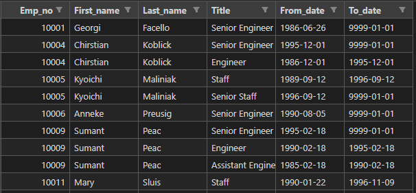
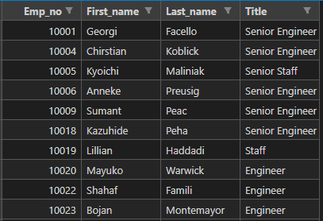
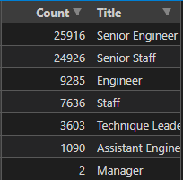
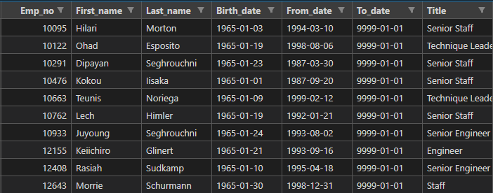

# Written Report on the Employee Database Analysis

## ***Overview of the school district analysis***

### **Purpose**
<!--Explain the purpose of this analysis.-->
<!--The purpose of the new analysis is well defined. (3 pt)-->

The report will provide Pewlett-Hackard the insights where is determined the number of retiring employees per title, and more important to identify the number of employees who are eligible to participate in a mentorship program. The idea of ​​having this data is so that the company is prevented in the next exit of its workers to retire and be prepared internally. In the end, the report will give a summarized analysis that will help to prepare Bobby’s manager for the “silver tsunami” tendency.

 

## ***Results***
<!--Provide a bulleted list with four major points from the two analysis deliverables. Use images as support where needed.-->
<!--There is a bulleted list with four major points from the two analysis deliverables. (6 pt)-->

### **Major points from the analysis**

<table>
    <tr>
        <td>- Retirement Titles</td>
    </tr>
    <tr>
        <td></td>
    </tr>
</table>

    In order to get the right data we need to filter down until we have the correct table to visualize the informaion we require. The "retirement titles" table is a good example of how the steps we need to take, this because when we combine two intial tables, this doesn't mean that the new table is necessary the correct one for our anaylisis. In this case this table could be catalogued as a 'pre-final' table, the reason is because the information inside the table only have a filter of the bith date (01-01-1952-01-01 and 31-12-1955), but we need to do another table because as the image shows there are some duplicates employees.

<table>
    <tr>
        <td>- Unique Titles</td>
    </tr>
    <tr>
        <td></td>
    </tr>
</table>

    This table is 'final' table extracted from the previous one (retirement table), this mean that the data was already cleaned from the duplicate employees. It is important to emphasize that the criteria was to leave out the duplicated employee number from the table, but leaving the most recent title of that employee. We can corroborate this by different forms: the number of total employees decreased from 133,766 to 72,458, at the images the first duplicated value: 10004, it appear one time in the second image, and finally in the same way we can see that it took the last title of that employee: Senior Engineer.

<table>
    <tr>
        <td>- Retiring Titles</td>
    </tr>
    <tr>
        <td></td>
    </tr>
</table>

    In this case, the the generated table is showing a specific data, because is only giving how many employees per title will retire. This will give a general overview to the company, but principally gives count of the total employees, that is already mentioned in the last point: 72,458 employees.

<table>
    <tr>
        <td>- Mentorship Eligibility</td>
    </tr>
    <tr>
        <td></td>
    </tr>
</table>

    This final table is showing how many employees are eligible to to participate in a mentorship program. This list of people is important for the future of the company because they will be the ones that will pass the know-how of their expierence in the company.

 

## ***Summary***
<!--Provide high-level responses to the following questions, then provide two additional queries or tables that may provide more insight into the upcoming "silver tsunami."-->
<!--The summary addresses the two questions and contains two additional queries or tables that may provide more insight. (5 pt)-->

### **How many roles will need to be filled as the "silver tsunami" begins to make an impact?**

As we already mentioned, a total of 72,458 employees are eligible to be retired soon. This is a huge number to be consider, but the focus should be in both Senior positions of 'Engineer' and 'Staff', because the sum of both titles give us a 70% of the total retires. But ths doesn't mean that the other titles need to be left aside, just that the Senior positions need to be a prority.

### **Are there enough qualified, retirement-ready employees in the departments to mentor the next generation of Pewlett Hackard employees?**

Based of the numbers of the total mentors prospects - 1,549, and the detail of each title, there are not enough qualified retirement-ready employees. As an example the "Senior Engineer (SE)" position only have 529 possible mentors and there are 59,494 Senior Engineers to be mentored. It is 112 SE per 1 mentor.

### **Additional queries or tables that may provide more insight.**

- One additional table could be the count of the mentors per title, this to give the support of the answer of previous question. The possible query:
  - SELECT COUNT (me.emp_no), me.title
  - INTO mentorship_titles
  - FROM mentorship_eligibility AS me
  - GROUP BY me.title
  - ORDER BY COUNT (me.emp_no) DESC;

- Another additional query is to add a "modified" version of the mentorship eligibility to a two year range, in order to try to cover the demand of people to be mentored.
  - SELECT DISTINCT ON (e.emp_no) e.emp_no,
    - e.first_name,
	- e.last_name,
	- e.birth_date,
	- de.from_date,
	- de.to_date,
	- t.title
  - INTO mentorship_eligibilty
  - FROM employees AS e
  - INNER JOIN dept_emp AS de
  - ON (e.emp_no = de.emp_no)
  - INNER JOIN titles AS t
  - ON (e.emp_no = t.emp_no)
  - WHERE (de.to_date = '9999-01-01')
  - AND (e.birth_date BETWEEN '1965-01-01' AND '1966-12-31')
  - ORDER BY e.emp_no;